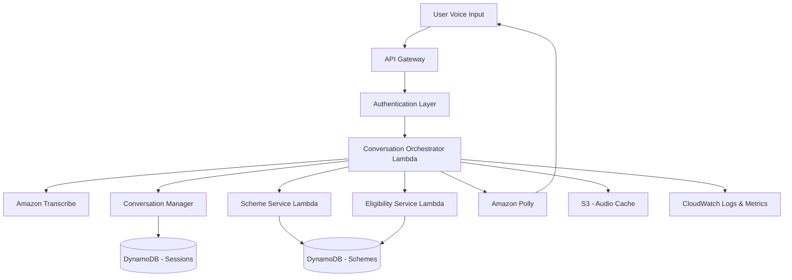

# Design Document: Bharat Assist

## Overview

Bharat Assist is a serverless, cloud-native multilingual voice assistant built on AWS infrastructure. The system leverages AWS managed services for speech processing, conversation management, and data storage to provide an accessible interface for rural citizens to learn about and apply for government schemes.

The architecture follows a microservices pattern with event-driven communication, ensuring scalability, maintainability, and cost-effectiveness. The system supports 10+ Indian regional languages and provides natural voice interaction with intelligent conversation flow management.

## Architecture

### High-Level Architecture



### Component Architecture

The system is composed of the following major components:

1. **API Gateway**: Entry point for all client requests, handles routing and throttling
2. **Conversation Orchestrator**: Main Lambda function coordinating all services
3. **Speech Recognition Service**: Amazon Transcribe for multilingual speech-to-text
4. **Text-to-Speech Service**: Amazon Polly for natural voice synthesis
5. **Conversation Manager**: Maintains context and manages dialogue flow
6. **Scheme Service**: Handles scheme information retrieval and search
7. **Eligibility Engine**: Evaluates user eligibility based on scheme criteria
8. **Session Store**: DynamoDB table for temporary session data
9. **Scheme Database**: DynamoDB table for government scheme information

### Technology Stack

- **Compute**: AWS Lambda (Node.js/Python runtime)
- **API Layer**: Amazon API Gateway (REST API)
- **Speech-to-Text**: Amazon Transcribe (supports 10+ Indian languages)
- **Text-to-Speech**: Amazon Polly (Neural TTS with Indian language support)
- **Database**: Amazon DynamoDB (serverless NoSQL)
- **Storage**: Amazon S3 (audio file caching)
- **Monitoring**: Amazon CloudWatch (logs, metrics, alarms)
- **Security**: AWS IAM, AWS KMS for encryption

## Components and Interfaces

### 1. API Gateway

**Responsibility**: Serve as the entry point for all client requests

**Endpoints**:
- `POST /session/start` - Initialize a new user session
- `POST /session/voice` - Process voice input
- `POST /session/text` - Process text input (fallback)
- `GET /session/{sessionId}` - Retrieve session state
- `DELETE /session/{sessionId}` - End session and cleanup
- `GET /health` - Health check endpoint

**Interface**:
```typescript
interface VoiceRequest {
  sessionId: string;
  audioData: string; // Base64 encoded audio
  audioFormat: 'wav' | 'mp3' | 'ogg';
  language?: string; // Optional language hint
}

interface VoiceResponse {
  sessionId: string;
  transcribedText: string;
  responseText: string;
  audioUrl: string; // Pre-signed S3 URL for audio response
  conversationState: ConversationState;
  suggestions?: string[]; // Quick reply options
}

interface SessionStartRequest {
  language?: string;
  userId?: string; // Optional for returning users
}

interface SessionStartResponse {
  sessionId: string;
  welcomeMessage: string;
  audioUrl: string;
  supportedLanguages: Language[];
}
```

### 2. Conversation Orchestrator Lambda

**Responsibility**: Coordinate all services and manage request/response flow

**Key Functions**:
- Route requests to appropriate services
- Manage service call sequencing
- Handle error recovery and retries
- Aggregate responses from multiple services
- Implement circuit breaker pattern for resilience

**Interface**:
```typescript
interface OrchestrationContext {
  sessionId: string;
  userId?: string;
  language: string;
  conversationHistory: Message[];
  userProfile: UserProfile;
}

interface OrchestrationResult {
  success: boolean;
  responseText: string;
  audioUrl?: string;
  nextAction?: string;
  error?: ErrorDetails;
}

class ConversationOrchestrator {
  async processVoiceInput(context: OrchestrationContext, audioData: Buffer): Promise<OrchestrationResult>;
  async processTextInput(context: OrchestrationContext, text: string): Promise<OrchestrationResult>;
  async handleError(error: Error, context: OrchestrationContext): Promise<OrchestrationResult>;
}
```

### 3. Speech Recognition Service (Amazon Transcribe)

**Responsibility**: Convert voice input to text in multiple Indian languages

**Supported Languages**:
- Hindi (hi-IN)
- Bengali (bn-IN)
- Telugu (te-IN)
- Marathi (mr-IN)
- Tamil (ta-IN)
- Gujarati (gu-IN)
- Kannada (kn-IN)
- Malayalam (ml-IN)
- Odia (or-IN)
- Punjabi (pa-IN)

**Configuration**:
```typescript
interface TranscribeConfig {
  languageCode: string;
  mediaSampleRateHertz: number; // 8000 or 16000
  enableAutomaticPunctuation: boolean;
  vocabularyName?: string; // Custom vocabulary for scheme names
  maxSpeakerLabels?: number;
}

interface TranscriptionResult {
  transcript: string;
  confidence: number;
  languageDetected?: string;
  alternatives?: TranscriptAlternative[];
}

class SpeechRecognitionService {
  async transcribe(audioData: Buffer, config: TranscribeConfig): Promise<TranscriptionResult>;
  async transcribeStreaming(audioStream: ReadableStream, config: TranscribeConfig): AsyncIterator<TranscriptionResult>;
}
```

### 4. Text-to-Speech Service (Amazon Polly)

**Responsibility**: Generate natural-sounding speech from text responses

**Voice Selection**:
- Hindi: Aditi (Neural), Kajal (Neural)
- Tamil: No native neural voice (use standard)
- Other languages: Standard voices available

**Configuration**:
```typescript
interface PollyConfig {
  languageCode: string;
  voiceId: string;
  engine: 'standard' | 'neural';
  outputFormat: 'mp3' | 'ogg_vorbis' | 'pcm';
  sampleRate: string;
  speechRate?: 'slow' | 'medium' | 'fast'; // SSML rate
  textType: 'text' | 'ssml';
}

interface SpeechSynthesisResult {
  audioStream: Buffer;
  audioUrl?: string; // S3 URL if cached
  duration: number; // milliseconds
}

class TextToSpeechService {
  async synthesize(text: string, config: PollyConfig): Promise<SpeechSynthesisResult>;
  async synthesizeSSML(ssml: string, config: PollyConfig): Promise<SpeechSynthesisResult>;
  getCachedAudio(textHash: string, language: string): Promise<string | null>;
}
```

### 5. Conversation Manager

**Responsibility**: Maintain conversation context and manage dialogue flow

**Conversation States**:
- `LANGUAGE_SELECTION` - Initial language selection
- `MAIN_MENU` - Main menu navigation
- `SCHEME_BROWSING` - Browsing available schemes
- `SCHEME_DETAILS` - Viewing specific scheme details
- `ELIGIBILITY_CHECK` - Collecting information for eligibility
- `APPLICATION_GUIDE` - Providing step-by-step guidance
- `CONFIRMATION` - Confirming user actions

**Interface**:
```typescript
interface ConversationState {
  currentState: string;
  previousState?: string;
  context: Record<string, any>;
  collectedData: Record<string, any>;
  lastInteraction: number; // timestamp
}

interface Message {
  role: 'user' | 'assistant';
  content: string;
  timestamp: number;
  metadata?: Record<string, any>;
}

interface Intent {
  name: string;
  confidence: number;
  slots: Record<string, any>;
}

class ConversationManager {
  async updateState(sessionId: string, newState: string, context: Record<string, any>): Promise<void>;
  async getState(sessionId: string): Promise<ConversationState>;
  async addMessage(sessionId: string, message: Message): Promise<void>;
  async getHistory(sessionId: string, limit?: number): Promise<Message[]>;
  async detectIntent(text: string, language: string): Promise<Intent>;
  async generateResponse(intent: Intent, state: ConversationState, language: string): Promise<string>;
  async clearSession(sessionId: string): Promise<void>;
}
```

### 6. Scheme Service

**Responsibility**: Manage government scheme information and search

**Interface**:
```typescript
interface Scheme {
  schemeId: string;
  name: Record<string, string>; // Multilingual names
  description: Record<string, string>; // Multilingual descriptions
  category: string;
  eligibilityCriteria: EligibilityCriteria;
  benefits: string[];
  applicationProcess: ApplicationStep[];
  requiredDocuments: string[];
  deadline?: string;
  contactInfo: ContactInfo;
  lastUpdated: number;
}

interface EligibilityCriteria {
  age?: { min?: number; max?: number };
  income?: { max?: number; currency: string };
  gender?: 'male' | 'female' | 'other' | 'any';
  location?: string[]; // States/districts
  occupation?: string[];
  customCriteria?: Record<string, any>;
}

interface ApplicationStep {
  stepNumber: number;
  description: Record<string, string>;
  requiredDocuments?: string[];
  location?: string;
  estimatedTime?: string;
}

interface SchemeSearchQuery {
  category?: string;
  keywords?: string[];
  language: string;
  limit?: number;
}

class SchemeService {
  async getScheme(schemeId: string, language: string): Promise<Scheme>;
  async searchSchemes(query: SchemeSearchQuery): Promise<Scheme[]>;
  async getSchemesByCategory(category: string, language: string): Promise<Scheme[]>;
  async getAllCategories(language: string): Promise<string[]>;
  async updateScheme(scheme: Scheme): Promise<void>;
  async addScheme(scheme: Scheme): Promise<string>;
}
```

### 7. Eligibility Engine

**Responsibility**: Evaluate user eligibility for government schemes

**Interface**:
```typescript
interface UserProfile {
  age?: number;
  gender?: string;
  income?: number;
  location?: {
    state: string;
    district?: string;
    pincode?: string;
  };
  occupation?: string;
  customAttributes?: Record<string, any>;
}

interface EligibilityResult {
  eligible: boolean;
  matchedCriteria: string[];
  unmatchedCriteria: string[];
  confidence: number;
  explanation: Record<string, string>; // Multilingual explanation
  alternativeSchemes?: string[]; // Scheme IDs
}

interface EligibilityQuestion {
  questionId: string;
  questionText: Record<string, string>;
  fieldName: string;
  inputType: 'number' | 'text' | 'choice' | 'boolean';
  choices?: string[];
  validation?: ValidationRule;
}

class EligibilityEngine {
  async checkEligibility(schemeId: string, userProfile: UserProfile): Promise<EligibilityResult>;
  async getRequiredQuestions(schemeId: string, language: string): Promise<EligibilityQuestion[]>;
  async findAlternativeSchemes(userProfile: UserProfile, excludeSchemeId: string): Promise<Scheme[]>;
  async validateUserInput(questionId: string, value: any): Promise<boolean>;
}
```

### 8. Session Store (DynamoDB)

**Responsibility**: Store temporary session data with TTL

**Schema**:
```typescript
interface SessionRecord {
  sessionId: string; // Partition key
  userId?: string;
  language: string;
  conversationState: ConversationState;
  userProfile: UserProfile;
  conversationHistory: Message[];
  createdAt: number;
  lastAccessedAt: number;
  ttl: number; // DynamoDB TTL (24 hours)
}

// DynamoDB Table Configuration
const SessionTableConfig = {
  tableName: 'BharatAssist-Sessions',
  partitionKey: 'sessionId',
  ttlAttribute: 'ttl',
  billingMode: 'PAY_PER_REQUEST',
  pointInTimeRecovery: true
};
```

### 9. Scheme Database (DynamoDB)

**Responsibility**: Store government scheme information

**Schema**:
```typescript
interface SchemeRecord {
  schemeId: string; // Partition key
  category: string; // GSI partition key
  name: Record<string, string>;
  description: Record<string, string>;
  eligibilityCriteria: EligibilityCriteria;
  benefits: string[];
  applicationProcess: ApplicationStep[];
  requiredDocuments: string[];
  deadline?: string;
  contactInfo: ContactInfo;
  searchKeywords: string[]; // For text search
  lastUpdated: number;
  version: number;
}

// DynamoDB Table Configuration
const SchemeTableConfig = {
  tableName: 'BharatAssist-Schemes',
  partitionKey: 'schemeId',
  globalSecondaryIndexes: [
    {
      indexName: 'CategoryIndex',
      partitionKey: 'category',
      sortKey: 'lastUpdated'
    }
  ],
  billingMode: 'PAY_PER_REQUEST',
  pointInTimeRecovery: true
};
```

## Data Models

### Language Support

```typescript
enum SupportedLanguage {
  HINDI = 'hi-IN',
  BENGALI = 'bn-IN',
  TELUGU = 'te-IN',
  MARATHI = 'mr-IN',
  TAMIL = 'ta-IN',
  GUJARATI = 'gu-IN',
  KANNADA = 'kn-IN',
  MALAYALAM = 'ml-IN',
  ODIA = 'or-IN',
  PUNJABI = 'pa-IN'
}

interface Language {
  code: SupportedLanguage;
  name: string;
  nativeName: string;
  transcribeSupported: boolean;
  pollyVoiceId: string;
  pollyEngine: 'standard' | 'neural';
}
```

### Intent Classification

```typescript
enum IntentType {
  LANGUAGE_SELECTION = 'language_selection',
  BROWSE_SCHEMES = 'browse_schemes',
  SCHEME_DETAILS = 'scheme_details',
  CHECK_ELIGIBILITY = 'check_eligibility',
  APPLICATION_GUIDE = 'application_guide',
  PROVIDE_INFORMATION = 'provide_information',
  REPEAT_LAST = 'repeat_last',
  GO_BACK = 'go_back',
  MAIN_MENU = 'main_menu',
  END_SESSION = 'end_session',
  HELP = 'help'
}

interface ClassifiedIntent {
  type: IntentType;
  confidence: number;
  entities: Record<string, any>;
  rawText: string;
}
```

### Error Types

```typescript
enum ErrorType {
  TRANSCRIPTION_FAILED = 'transcription_failed',
  SPEECH_SYNTHESIS_FAILED = 'speech_synthesis_failed',
  SERVICE_UNAVAILABLE = 'service_unavailable',
  INVALID_INPUT = 'invalid_input',
  SESSION_EXPIRED = 'session_expired',
  SCHEME_NOT_FOUND = 'scheme_not_found',
  DATABASE_ERROR = 'database_error',
  TIMEOUT = 'timeout'
}

interface ErrorDetails {
  type: ErrorType;
  message: string;
  userMessage: Record<string, string>; // Multilingual user-facing message
  retryable: boolean;
  timestamp: number;
}
```

## Correctness Properties

*A property is a characteristic or behavior that should hold true across all valid executions of a system—essentially, a formal statement about what the system should do. Properties serve as the bridge between human-readable specifications and machine-verifiable correctness guarantees.*

Project Name: Bharat Assist

Description:
Build a multilingual AI voice assistant that helps rural citizens understand government schemes in their regional language. The system should support voice interaction, check eligibility based on user input, and guide users step-by-step on how to apply for schemes. The solution should be simple, accessible, and hosted on AWS cloud infrastructure.

### Property 1: Speech Transcription Accuracy

*For any* supported regional language and valid audio input in that language, the Speech Recognition Service should produce a transcription that accurately represents the spoken content.

**Validates: Requirements 1.1**

### Property 2: System-Wide Language Support Consistency

*For any* language supported by the Speech Recognition Service, the Text-to-Speech Service should also support that same language, ensuring bidirectional communication capability.

**Validates: Requirements 1.2, 2.2**

### Property 3: Noise-Resilient Transcription

*For any* valid speech audio with background noise below a defined threshold, the Speech Recognition Service should still produce an accurate transcription by filtering the noise.

**Validates: Requirements 1.3**

### Property 4: Transcription Error Recovery

*For any* speech input that cannot be transcribed with sufficient confidence, the Voice Assistant should respond with a prompt asking the user to repeat their input.

**Validates: Requirements 1.4**

### Property 5: Speech Rate Control

*For any* text response and any speech rate setting (slow, medium, fast), the Text-to-Speech Service should generate audio with the corresponding duration (slower rate = longer duration, faster rate = shorter duration).

**Validates: Requirements 2.4**

### Property 6: Response Replay Capability

*For any* user session with at least one assistant response, requesting a repeat should return the same response content that was previously provided.

**Validates: Requirements 2.5, 15.2**

### Property 7: Language Selection Confirmation

*For any* language selection or detection event, the Voice Assistant should send a confirmation message to the user in the selected language.

**Validates: Requirements 3.3**

### Property 8: Language Switching Flexibility

*For any* conversation state and any supported language, the user should be able to switch to that language and receive subsequent responses in the new language.

**Validates: Requirements 3.4**

### Property 9: Language Preference Persistence

*For any* user with a previous session, starting a new session should default to the language used in their most recent session.

**Validates: Requirements 3.5**

### Property 10: Scheme Retrieval by Category

*For any* scheme category and any language, requesting schemes in that category should return only schemes that belong to that category, with information in the requested language.

**Validates: Requirements 4.1, 4.4**

### Property 11: Eligibility Question Completeness

*For any* government scheme with defined eligibility criteria, the Eligibility Engine should ask questions that cover all required criteria fields before making an eligibility determination.

**Validates: Requirements 5.1**

### Property 12: Eligibility Determination Correctness

*For any* scheme and user profile, the eligibility determination should match the result of manually evaluating the user profile against the scheme's eligibility criteria.

**Validates: Requirements 5.3**

### Property 13: Eligibility Explanation Presence

*For any* eligibility determination (eligible or ineligible), the response should include a non-empty explanation describing the reasoning.

**Validates: Requirements 5.4**

### Property 14: Alternative Scheme Eligibility

*For any* user profile that is ineligible for a requested scheme, all suggested alternative schemes should be schemes for which the user profile meets the eligibility criteria.

**Validates: Requirements 5.5**

### Property 15: Application Steps Completeness

*For any* scheme with an application process, requesting application guidance should return all application steps in sequential order.

**Validates: Requirements 6.1**

### Property 16: Application Guide Data Completeness

*For any* scheme's application guide, the data should include required documents, application location information, and deadline information (if applicable).

**Validates: Requirements 6.2**

### Property 17: Step Clarification Detail

*For any* application step, requesting clarification should return additional information beyond what was provided in the initial step description.

**Validates: Requirements 6.4**

### Property 18: Application Step Navigation

*For any* application step that is not the first or last step, the user should be able to navigate to both the previous and next steps.

**Validates: Requirements 6.5, 9.5**

### Property 19: Session State Persistence

*For any* information provided by the user during a session, that information should be stored in the session state and remain accessible throughout the session without requiring the user to provide it again.

**Validates: Requirements 7.1, 7.2, 9.1**

### Property 20: Session Data Cleanup

*For any* session that has ended, attempting to retrieve that session's data should fail or return empty results, confirming that sensitive information has been cleared.

**Validates: Requirements 7.3**

### Property 21: User Information Review and Update

*For any* user profile information stored in a session, the user should be able to retrieve that information for review and update it, with subsequent operations using the updated values.

**Validates: Requirements 7.4**

### Property 22: PII Persistence Consent

*For any* session without explicit user consent for data persistence, personally identifiable information should not be stored in any persistent storage after the session ends.

**Validates: Requirements 7.5**

### Property 23: Inactivity Prompt

*For any* session that experiences user inactivity beyond a defined timeout threshold, the Voice Assistant should send a prompt to guide the user.

**Validates: Requirements 8.2**

### Property 24: Important Action Confirmation

*For any* action classified as important (such as ending a session or submitting information), the Voice Assistant should request user confirmation before executing the action.

**Validates: Requirements 8.3**

### Property 25: Choice Presentation Completeness

*For any* response that presents multiple options to the user, all available options should be included in the response text.

**Validates: Requirements 8.4**

### Property 26: Error Response Helpfulness

*For any* error condition, the error response should include both an explanation of what went wrong and a suggested corrective action.

**Validates: Requirements 8.5, 12.4**

### Property 27: Contextual Follow-up Understanding

*For any* multi-turn conversation, follow-up questions that reference previous context (using pronouns or implicit references) should be resolved correctly using the conversation history.

**Validates: Requirements 9.2**

### Property 28: Topic Switching Capability

*For any* conversation state, the user should be able to switch to a different topic, and the Voice Assistant should respond appropriately to the new topic without requiring the previous topic to be completed.

**Validates: Requirements 9.3**

### Property 29: Long Conversation Summarization

*For any* conversation that exceeds a defined length threshold (e.g., 10 turns), the Voice Assistant should provide a summary of key points before continuing.

**Validates: Requirements 9.4**

### Property 30: Long Operation Status Updates

*For any* operation that takes longer than 5 seconds to complete, the Voice Assistant should provide at least one status update to inform the user that processing is ongoing.

**Validates: Requirements 11.3**

### Property 31: Scheme Information Caching

*For any* scheme that has been retrieved once in a session, subsequent requests for the same scheme should be served from cache, resulting in faster response times.

**Validates: Requirements 11.5**

### Property 32: Service Unavailability Handling

*For any* temporary service failure, the Voice Assistant should return an error message informing the user of the issue and suggesting they try again later.

**Validates: Requirements 12.2**

### Property 33: Session Recovery

*For any* interrupted session, the user should be able to resume the session and continue from the conversation state that existed before the interruption.

**Validates: Requirements 12.3**

### Property 34: Error Logging

*For any* error that occurs during system operation, an error log entry should be created containing details about the error.

**Validates: Requirements 12.5**

### Property 35: Audio Storage Consent

*For any* session without explicit user consent for audio recording, voice audio should not be stored in persistent storage.

**Validates: Requirements 13.2**

### Property 36: Privacy Notice on PII Collection

*For any* request that collects personally identifiable information, the response should include a privacy notice informing the user about how their data will be used.

**Validates: Requirements 13.3**

### Property 37: Scheme CRUD Operations

*For any* valid scheme data, the Scheme Database should support creating a new scheme, retrieving it, updating it, and deleting it, with each operation completing successfully.

**Validates: Requirements 14.1**

### Property 38: Scheme Version History

*For any* scheme that is updated, the Scheme Database should retain the previous version, allowing version history to be retrieved.

**Validates: Requirements 14.2**

### Property 39: Scheme Data Validation

*For any* scheme data that is missing required fields (name, description, eligibility criteria, or application process), attempting to save it should fail with a validation error.

**Validates: Requirements 14.3**

### Property 40: Bulk Scheme Import

*For any* collection of valid scheme records, the bulk import operation should successfully store all schemes in the database.

**Validates: Requirements 14.4**

### Property 41: Alternative Input Method Offering

*For any* speech input with very low transcription confidence, the Voice Assistant should offer alternative input methods (such as text input or simplified yes/no questions).

**Validates: Requirements 15.4**

### Property 42: Yes/No Response Recognition

*For any* question that expects a yes/no answer, providing a simple "yes" or "no" response (in any supported language) should be correctly recognized and processed.

**Validates: Requirements 15.5**

### Property 43: Interaction Logging with PII Redaction

*For any* user interaction that is logged, personally identifiable information should be redacted or anonymized in the log entry.

**Validates: Requirements 16.1**

### Property 44: Metrics Collection

*For any* completed session, metrics including session duration, completion status, and error count should be recorded.

**Validates: Requirements 16.2**

### Property 45: Performance Degradation Alerting

*For any* system performance metric that falls below a defined threshold, an alert should be sent to system administrators.

**Validates: Requirements 16.4**

### Property 46: Usage Report Generation

*For any* time period with user interactions, generating a usage report should produce aggregated statistics including most requested schemes and common user questions.

**Validates: Requirements 16.5**

## Error Handling

### Error Categories

The system handles errors in the following categories:

1. **Speech Processing Errors**
   - Transcription failures (low confidence, unsupported language)
   - Audio format issues
   - Speech synthesis failures

2. **Service Availability Errors**
   - AWS service temporary unavailability
   - Database connection failures
   - Timeout errors

3. **Data Errors**
   - Scheme not found
   - Invalid scheme data
   - Session expired or not found

4. **User Input Errors**
   - Invalid input format
   - Missing required information
   - Out-of-range values

### Error Handling Strategy

**Graceful Degradation**:
- When speech recognition fails, offer text input as fallback
- When TTS fails, provide text response only
- When scheme database is unavailable, provide cached information if available

**User-Friendly Error Messages**:
- All error messages translated to user's selected language
- Simple, non-technical language
- Clear guidance on what the user should do next
- Option to retry or return to main menu

**Retry Logic**:
- Automatic retry with exponential backoff for transient failures
- Maximum 3 retry attempts for service calls
- Circuit breaker pattern to prevent cascading failures

**Error Recovery**:
- Session state preserved during errors
- User can resume from last successful state
- Conversation context maintained across error recovery

### Error Response Format

```typescript
interface ErrorResponse {
  success: false;
  error: {
    type: ErrorType;
    code: string;
    message: string; // Technical message for logging
    userMessage: Record<string, string>; // Multilingual user-facing message
    retryable: boolean;
    suggestedAction: string;
  };
  sessionId: string;
  timestamp: number;
}
```

## Testing Strategy

### Dual Testing Approach

The testing strategy employs both unit testing and property-based testing to ensure comprehensive coverage:

- **Unit tests**: Verify specific examples, edge cases, and error conditions
- **Property tests**: Verify universal properties across all inputs
- Both approaches are complementary and necessary for comprehensive correctness validation

### Unit Testing

Unit tests focus on:
- Specific examples that demonstrate correct behavior
- Edge cases (empty inputs, boundary values, special characters)
- Error conditions and error handling paths
- Integration points between components
- Language-specific behavior for each supported language

**Example Unit Tests**:
- Test transcription of a specific Hindi phrase
- Test eligibility check with a user exactly at age boundary
- Test session cleanup after timeout
- Test error response when scheme ID doesn't exist
- Test language switching from Hindi to Tamil

### Property-Based Testing

Property-based testing validates the 46 correctness properties defined above. Each property test should:
- Run a minimum of 100 iterations with randomized inputs
- Reference the design document property it validates
- Use appropriate generators for test data (random schemes, user profiles, audio samples, etc.)

**Property Test Configuration**:
- Testing library: Use language-appropriate PBT library (fast-check for TypeScript/JavaScript, Hypothesis for Python)
- Minimum iterations: 100 per property test
- Tag format: `Feature: bharat-assist, Property {number}: {property_text}`

**Example Property Test Tags**:
- `Feature: bharat-assist, Property 12: Eligibility Determination Correctness`
- `Feature: bharat-assist, Property 19: Session State Persistence`
- `Feature: bharat-assist, Property 37: Scheme CRUD Operations`

### Test Data Generation

**Generators Needed**:
- Random scheme data with valid eligibility criteria
- Random user profiles with varying attributes
- Random audio samples in different languages
- Random conversation histories
- Random session states

**Test Data Considerations**:
- Include all 10 supported languages in test data
- Generate edge cases (empty strings, very long inputs, special characters)
- Include invalid data for negative testing
- Use realistic Indian names, locations, and scheme types

### Integration Testing

Integration tests verify:
- End-to-end conversation flows
- AWS service integration (Transcribe, Polly, DynamoDB)
- Multi-step processes (eligibility check → application guidance)
- Session management across multiple requests
- Error recovery and retry logic

### Performance Testing

Performance tests validate:
- Response time requirements (< 5 seconds for simple queries)
- Concurrent user handling (100+ concurrent sessions)
- Database query performance
- Cache effectiveness
- AWS service latency

### Security Testing

Security tests verify:
- Data encryption in transit
- PII redaction in logs
- Session data cleanup
- Authentication for admin endpoints
- Input validation and sanitization

## Deployment Architecture

### AWS Services Used

- **API Gateway**: REST API endpoint with throttling and API keys
- **Lambda**: Serverless compute for all business logic
- **Amazon Transcribe**: Speech-to-text for 10 Indian languages
- **Amazon Polly**: Text-to-speech with neural voices
- **DynamoDB**: NoSQL database for schemes and sessions
- **S3**: Audio file caching and static assets
- **CloudWatch**: Logging, metrics, and alarms
- **IAM**: Access control and service permissions
- **KMS**: Encryption key management
- **CloudFront**: CDN for audio file delivery (optional)

### Deployment Strategy

**Infrastructure as Code**:
- Use AWS CDK or CloudFormation for infrastructure provisioning
- Version control all infrastructure code
- Separate stacks for different environments (dev, staging, prod)

**CI/CD Pipeline**:
- Automated testing on every commit
- Automated deployment to dev environment
- Manual approval for staging and production deployments
- Rollback capability for failed deployments

**Environment Configuration**:
- Development: Lower DynamoDB capacity, shorter session TTL
- Staging: Production-like configuration for testing
- Production: Auto-scaling enabled, full monitoring, backups enabled

### Monitoring and Observability

**CloudWatch Metrics**:
- API Gateway request count and latency
- Lambda invocation count, duration, and errors
- DynamoDB read/write capacity utilization
- Transcribe and Polly API call counts
- Custom metrics: session count, eligibility checks, scheme requests

**CloudWatch Alarms**:
- Lambda error rate > 5%
- API Gateway 5xx errors > 1%
- DynamoDB throttling events
- Average response time > 5 seconds
- Transcribe/Polly service errors

**Logging Strategy**:
- Structured JSON logging
- Log levels: DEBUG, INFO, WARN, ERROR
- PII redaction in all logs
- Centralized log aggregation
- Log retention: 30 days for application logs, 90 days for audit logs

**Dashboards**:
- Real-time system health dashboard
- User analytics dashboard (sessions, popular schemes, languages used)
- Error tracking dashboard
- Performance metrics dashboard

### Scalability Considerations

**Auto-Scaling**:
- Lambda: Automatic scaling up to account limits
- DynamoDB: On-demand billing mode for automatic scaling
- API Gateway: Throttling limits to prevent abuse

**Caching Strategy**:
- S3 for audio file caching (reduce Polly costs)
- DynamoDB for scheme data (reduce database reads)
- CloudFront for CDN caching (reduce latency)

**Cost Optimization**:
- Use Lambda reserved concurrency for predictable workloads
- Cache frequently accessed scheme information
- Compress audio files to reduce S3 storage costs
- Use DynamoDB on-demand billing for variable traffic
- Set appropriate session TTL to minimize storage costs

### Security Measures

**Data Protection**:
- TLS 1.2+ for all API communications
- Encryption at rest for DynamoDB tables
- KMS encryption for S3 objects
- PII redaction in CloudWatch logs

**Access Control**:
- IAM roles with least privilege principle
- API Gateway API keys for client authentication
- Admin endpoints protected by IAM authentication
- VPC endpoints for private AWS service access (optional)

**Compliance**:
- Data residency in Indian AWS regions (ap-south-1)
- Audit logging for all data access
- Regular security assessments
- Compliance with Indian data protection regulations

## Future Enhancements

Potential future enhancements to consider:

1. **Additional Languages**: Support for more regional languages and dialects
2. **Offline Mode**: Cached scheme information for areas with poor connectivity
3. **SMS Integration**: Send application steps and reminders via SMS
4. **Document Upload**: Allow users to upload required documents
5. **Application Status Tracking**: Track application status after submission
6. **Personalized Recommendations**: ML-based scheme recommendations
7. **Voice Biometrics**: Voice-based user authentication for returning users
8. **Multi-Modal Interface**: Web and mobile app interfaces in addition to voice
9. **Regional Scheme Support**: More comprehensive state and local scheme coverage
10. **Integration with Government Systems**: Direct application submission to government portals
